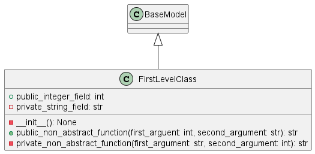

# py2plantuml

py2plantuml creates plant-uml compatible text files to create class diagrams for your python classes.

- [py2plantuml](#py2plantuml)
  - [Introduction](#introduction)
  - [Usage](#usage)
  - [Alternatives](#alternatives)


## Introduction
Why yet another uml parser?
Because existing parsers don't do what I want them to.  

## Usage
General call:
```sh
python src/main.py -p path/to/project -c classToParse -o outputFile
```

Example call with test class ```FirstLevelClass```:
```sh
python src/main.py -p src/test/test_data -c FirstLevelClass -o test.txt
```

Source code for FirstLevelClass:
```python
from pydantic import BaseModel


class FirstLevelClass(BaseModel):
    public_integer_field: int
    _private_string_field: str

    def __init__(self) -> None:
        self.public_integer_field = 0
        self._private_string_field = "string"

    def public_non_abstract_function(self, first_arguent: int, second_argument: str) -> str:
        return f"{first_arguent}_{second_argument}"

    def _private_non_abstract_function(self, first_argument: str, second_argument: int) -> str:
        return f"{first_argument}_{second_argument}"
```

Generated output for Plant-UML:
```
@startuml
class FirstLevelClass {
    + public_integer_field: int
    - private_string_field: str

    - __init__(): None
    + public_non_abstract_function(first_arguent: int, second_argument: str): str
    - private_non_abstract_function(first_argument: str, second_argument: int): str
}
BaseModel <|-- FirstLevelClass
@enduml
```

Generated class diagram with PlantUml:




## Alternatives

